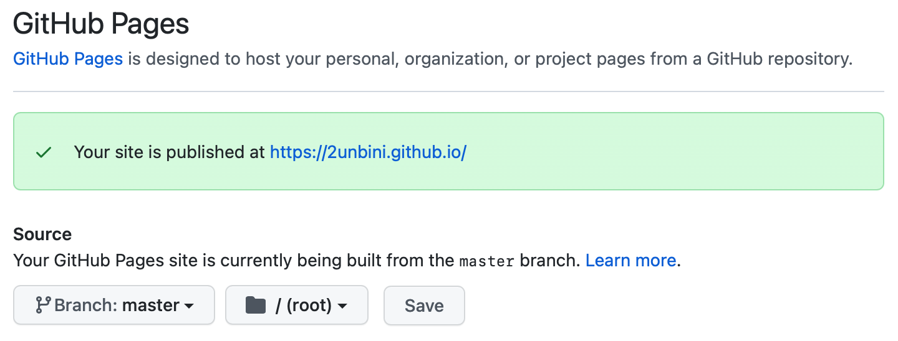

# 깃허브 블로그 테마 적용하기

> fork, 복사 붙여넣기, remote . . .

<br/>

지난 글의 말미에 소개했듯, [링크](http://jekyllthemes.org)에 들어가면 `jekyll`로 만들어지 다양한 테마의 웹 페이지들이 있다.

나는 그 중 `minimal-mistake`를 사용했고, 테마를 적용하는 정말 많은 방법(fork, remote, 복사 붙여넣기 등...) 중, 나를 살려 준 **[엄청난 블로그](https://devinlife.com/howto/)** 에 소개된 방식을 따라했다.

<br/>

원래 다른 테마를 사용해서 블로그를 만드려고 했는데, 자꾸 뭐가 꼬여서 더 많은 사람들이 사용하는 테마로 바꾸었다.

테마를 선택할 때 자기의 스타일에 맞는 것도 좋지만, 사람들이 많이 사용해 지속적으로 버그나 기능이 업데이트 되는 테마를 선택하는 것도 좋은 선택일 것이다.

<br/>

### 앞서 만든 github.io 밀기

아니 왜 애써 만들어 놓은 녀석을 미나요?

나는 하나부터 열까지 테마로 쭉 만들어진 애를 쓸 것이기 때문에 그냥 내가 지금까지 적용 해 놓은(사실상 적용한 것도 없긴 함) 파일들을 싹 지워준다.

지우지 않고 내가 쓰고자 하는 테마를 `zip` 파일로 받아서 해당 테마의 내용을 모두 끌어다가 내 폴더에 대치시켜도 된다.

그런데, 이렇게 하면 서로 다른 디렉토리에 만들어진 같은 이름과 기능의 페이지들이 충돌하는 상황이 발생한다(경험담).

그래서 그냥 어차피 크게 수정한 것도 없으니 쿨하게 밀어준다.


<br />

### 원하는 테마 소스 받기

위 링크에서 테마를 찾았으면, 필히 그 곳에 깃허브 링크가 붙어 있을 것이다.

깃허브 레포로 가 `fork` 를 뜬 뒤, 해당 Readme 에 쓰여 있는 대로 블로그를 생성하는 것이 가장 일반적인 방법이다.

그런데 나는 `fork` 를 뜬 뒤 해당 레포를 `username.github.io` 로 바꾸는 과정에서 정상적으로 뭐가 작동이 안 돼서 그냥 포크 뜨는 건 포기하기로 했다.

 > 중요하지 않지만 의외로 중요할 수도 있는 것) `fork` 된 레포엔 커밋을 아무리 많이 해도 잔디가 심어지지 않는다.

<br/>

어 별로 중요하지 않은 말이 너무 길었다,,,

어쨌든 내가 사용하고 싶은 테마 깃허브에 들어가서 `git clone` 으로 로컬에 소스를 내려받는다.

```zsh
git clone https://github.com/어쩌구...
```

완료되면 해당 소스의 폴더로 이동한 뒤, 앞의 문서에서 했듯 `bundle` 을 통해 패키지를 받아준다.

```zsh
cd 폴더

bundle
```

잘 받아졌으면, 서버 명령어로 로컬에서 웹 페이지를 띄워보자.

```zsh
bundle exec jekyll serve
```

localhost:4000 에 정상적으로 웹 페이지가 뜨면, 이제 깃허브 페이지 호스팅을 이용하면 된다.

<br/>

### 내 레포에 이식하기

로컬에 받아준 소스를 내 깃허브 레포에 연결하는 과정이다.

지금 로컬에 받아놓은 소스는 해당 테마의 깃 레포에 연결돼있는 상태다. 이를 내 깃허브 레포에 연결시키려면 다음과 같이 실행한다.

```zsh
git remote remove origin
git remote add origin https://github.com/내레포주소
git push -u origin master
```

현재 연결된 깃 레포와 연결을 끊고, 내 깃 레포와 연결한 뒤, 그 상태를 저장하는 과정이라고 생각하면 된다.

이제 내 레포가 되었으니 폴더 이름도 바꿔보자.

```zsh
mv 원래폴더이름 바꿀폴더이름
```

근데 이 때, 바꿀 폴더 이름이 `username.github.io` 이고, 앞의 튜토리얼을 따라하면서 `username.github.io`로 된 폴더가 이미 존재한다면 이름이 바뀌는 대신 폴더가 이동하므로 해당 이름의 폴더가 있는지 없는지 먼저 확인해야 한다.

> `mv` 명령어 : 이름 바꾸기, 위치 이동하기

<br/>

### Github Pages 에서 확인하기

모든 게 완료됐다면 Github 에 들어가자.

내 레포의 Settings -> Pages 탭에 들어가면 다음과 같은 화면이 나온다.

<br/>



<br/>

위 이미지처럼 초록 바에 `username.github.io` 형식으로 published 됐는지 확인한다.

만약 이런 초록색이 안 뜨고, 아래 **Source** 가 비활성화 되어 있으면, 해당 소스 부분을 `master` 브랜치의 `/root`로 설정 해 준 뒤 `save` 를 눌러 활성화를 시켜 준다.

<br/>

### 블로그 개인 정보 설정하기

모든 테마에 `_config.yml` 이라는 파일이 있을 것이다.

이 파일엔 해당 웹 페이지의 구성 요소들에 대한 설정을 해 줄 수 있는데, 블로거의 정보나 로컬 시간 설정, `post`에 댓글을 달 수 있는 설정, `tags`, `category` 등에 대한 설정 등 다양한 설정을 해 줄 수 있다.

대부분의 경우 주석으로 어떤 정보를 담으면 되는지, 형식은 어떻게 되는지 친절하게 다 써 놓았다. 이에 따라 내가 원하는 부분의 정보를 맞춰 집어넣어주면 된다.

<br/>

### 첫 글 쓰기

jekyll 의 약속 중, 글은 `_post` 라는 폴더에 들어가야 한다는 것이 있다.

기본적으로 `_post` 라는 폴더가 있을 수 있지만, 없다면 그냥 루트 경로에 하나 만들어주자.

```zsh
mkdir _post
```

폴더를 만들었으면, 지정된 제목 형식에 따라 마크다운 문서를 하나 써 준다.

```zsh
vim 2021-09-01-first-post.md
```

`vim` 편집기를 썼지만, 이게 익숙하지 않은 사람들은 `echo` 를 사용해서 문서를 하나 써 주자.

```zsh
echo "hello" > 2021-09-01-first-post.md
```

여기서 쓰는 문서는 꼭 **마크다운 문서**여야 한다!

<br />

루트 경로로 간 뒤, push 해 주면 블로그에서 첫 글을 볼 수 있다.

캡쳐는... 까먹었다..ㅎ

끝!!